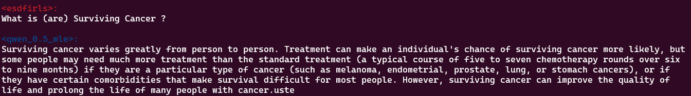
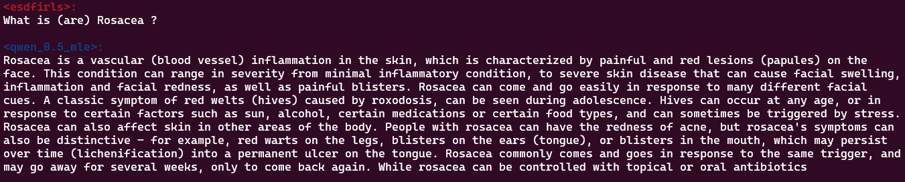

# Medical Question Answering Model Fine-tuning

## Introduction
This state-of-the-art text-generation model is tailored to provide accurate, contextually relevant, and coherent answers to user medical queries. The model achieves high performance while maintaining computational efficiency by leveraging advanced fine-tuning techniques, such as LoRA (Low-Rank Adaptation). The foundation model used for this project is **Qwen/Qwen2.5-0.5B**. This documentation provides an overview of the model's development, training, evaluation, and potential areas for improvement, along with example interactions to demonstrate its capabilities.

## Libraries Used
The following libraries are used in this project:
- `transformers`
- `trl`
- `peft`
- `accelerate`
- `evaluate`
- `torch`
- `bitsandbytes`

## Files
The project is organized into the following files:

- **`data_processing.py`**: Contains the `DataProcessor` class for loading, preprocessing, and transforming datasets.
- **`model_training.py`**: Implements the `ModelTrainer` class for fine-tuning the model using LoRA and evaluating its performance.
- **`evaluate_model.py`**: Includes the `Evaluate` class for assessing the model's performance using metrics like F1, ROUGE, and BLEU.
- **`train_accelerate.py`**: The main script to orchestrate data processing, model training, and evaluation.
- **`files/`**: Directory containing dataset files such as `mle_screening_dataset.csv` and PubMedQA JSON files (not used for training, requires more computational power).
- **`adapter/`**: Directory containing adapter-related modules for model fine-tuning.
- **`qwen_0.5_mle/`**: Directory containing Qwen tokenizer, merged model with adapters, and configuration files.

## Observations during Development and Training
- Input data is clean and well-structured, with clear distinctions between input and output fields (e.g., "question" and "answer").
- The model is designed for text-generation tasks and assumes that the dataset is suitable for such tasks. The model is adapted to a chat template.

## Model Performance
### Strengths
- The model demonstrates strong performance in generating coherent and contextually relevant answers for text-generation tasks.
- It effectively handles long sequences due to its configuration for a maximum sequence length of 512 tokens.
- The use of LoRA (Low-Rank Adaptation) enables efficient fine-tuning with reduced computational overhead. (TRL with Peft used in this challenge)

### Weaknesses
- The model may struggle with highly ambiguous or out-of-domain questions.
- It is sensitive to the quality of the training data; noisy or biased data can negatively impact performance.
- The model's performance may degrade for extremely long or complex queries that exceed its maximum sequence length.

## Potential Improvements or Extensions
- Refining the Model Architecture: Experiment with alternative architectures or larger pre-trained models to improve performance.
- Data Augmentation: Incorporate additional datasets or use data augmentation techniques to improve generalization. (Like pubmedQA, i had a try but it increased a lot the records, 280000+)
- Advanced Fine-Tuning: Explore advanced fine-tuning methods, such as reinforcement learning with human feedback (RLHF).
- Evaluation Metrics: Introduce additional metrics, such as perplexity or human evaluation, for a more comprehensive assessment.
- Error Analysis: Perform detailed error analysis to identify and address specific failure cases.

---

## Data Preprocessing Phase
1. Dataset Loading: The datasets are loaded using the `DataProcessor` class, which supports multiple sources (e.g., MLE screening dataset).
2. Concatenation: Multiple datasets can be concatenated to create a unified dataset for training.
3. Splitting: The dataset is split into training, validation, and test sets using a stratified approach.
4. Transformation: The datasets are tokenized and formatted to match the model's input requirements.

---

## Model Training Phase
1. Configuration: The training process is configured using the `SFTConfig` class, specifying parameters such as `max_length` and `output_dir`.
2. LoRA Integration: The model is fine-tuned using LoRA for efficient parameter updates.
3. Training: The `SFTTrainer` class is used to train the model on the training dataset, with evaluation performed on the test dataset during training.
4. Checkpointing: The model is saved periodically to ensure progress is not lost.

### Why Supervised Fine-Tuning Was Used
Supervised fine-tuning was employed to adapt the pre-trained model to the specific domain and task requirements. By using labeled datasets with clear input-output pairs, the model learns to generate contextually relevant and accurate responses tailored to medical queries. This approach ensures that the model aligns closely with the desired behavior, improving its performance on domain-specific tasks while maintaining coherence and relevance in its outputs. Additionally, supervised fine-tuning allows for better control over the model's behavior, reducing the likelihood of generating irrelevant or incorrect responses.

---

## Model Evaluation Phase
1. Evaluation Setup: The evaluation is performed using the `Evaluate` class, which initializes a text-generation pipeline.
2. Metrics: The model is evaluated using F1, ROUGE, and BLEU metrics to assess its performance on the test dataset. 
3. Results: The evaluation results are logged and analyzed to identify strengths and weaknesses.
4. Why they are used: Using these metrics together provides a more comprehensive evaluation of the model's performance:

F1 ensures a balance between precision and recall.
ROUGE emphasizes recall, which is important for capturing the completeness of the generated text.
BLEU emphasizes precision, ensuring that the generated text is accurate and relevant.
By combining these metrics, its better to understand the strengths and weaknesses of model, such as whether it generates text that is accurate, complete, or overly verbose.

---

## Example Interaction
Below is an example of how the model can be used for a QA task:

### Question 1
Input: "What is glaucoma?"  
Output: "Glaucoma is a condition in which the fluid that surrounds the optic nerve of the eye becomes very thick (glaucoma is called a
glaucoma- optic nerve compression, NGC) or becomes very full (glaucoma is called a glaucoma-decompression of the optic nerve). Each
case of glaucoma is unique and may happen with or without any other conditions. In some glaucoma cases, vision loss is very rapid and
can occur within minutes, while in others vision loss can occur weeks or months apart. Vision loss may be gradual or sudden
(intraocular pressure has to increase significantly to feel symptoms). Glaucoma usually affects only one eye or both eyes, but there
are several cases in which vision loss occurs in both eyes. In many cases, glaucoma can't be diagnosed during an eye exam or a
doctor's consultation (exam). Also, glaucoma can develop after eye surgery (such as LASIK, cataract surgery, glaucoma laser surgery,
or trabeculoplasty) or after eye burns. Glaucoma causes damage and damage (nearing) to the optic nerve, a line of neurons that connect
the retina to the brain. The optic nerve is important for vision, especially for visual objects"

### Question 2
Input: "What is (are) Surviving Cancer ?"  
Output: "Surviving cancer varies greatly from person to person. Treatment can make an individual's chance of surviving cancer more likely, but
some people may need much more treatment than the standard treatment (a typical course of five to seven chemotherapy rounds over six
to nine months) if they are a particular type of cancer (such as melanoma, endometrial, prostate, lung, or stomach cancers), or if
they have certain comorbidities that make survival difficult for most people. However, surviving cancer can improve the quality of
life and prolong the life of many people with cancer."

### Question 3
Input: "What is Heart Attack ?"  
Output: "Heart attacks or 'myocardial infarctions', or MI, occur when a blood clot forms in a coronary artery (the major blood
vessels leading from the heart) and blocks blood flow to the heart. The clot or blockage can then break off and travel
through the bloodstream and to different parts of the body, where it may lodge (stick). The obstruction of blood flow to
the heart can be life-threatening if it occurs suddenly or if part of the heart tissue is damaged by the clot."

### Question 4
Input: "What is (are) Rosacea ?"
Output: "Rosacea is a vascular (blood vessel) inflammation in the skin, which is characterized by painful and red lesions (papules) on the
face. This condition can range in severity from minimal inflammatory condition, to severe skin disease that can cause facial swelling,
inflammation and facial redness, as well as painful blisters. Rosacea can come and go easily in response to many different facial
cues. A classic symptom of red welts (hives) caused by roxodosis, can be seen during adolescence. Hives can occur at any age, or in
response to certain factors such as sun, alcohol, certain medications or certain food types, and can sometimes be triggered by stress.
Rosacea can also affect skin in other areas of the body. People with rosacea can have the redness of acne, but rosacea's symptoms can
also be distinctive - for example, red warts on the legs, blisters on the ears (tongue), or blisters in the mouth, which may persist
over time (lichenification) into a permanent ulcer on the tongue. Rosacea commonly comes and goes in response to the same trigger, and
may go away for several weeks, only to come back again. While rosacea can be controlled with topical or oral antibiotics"

