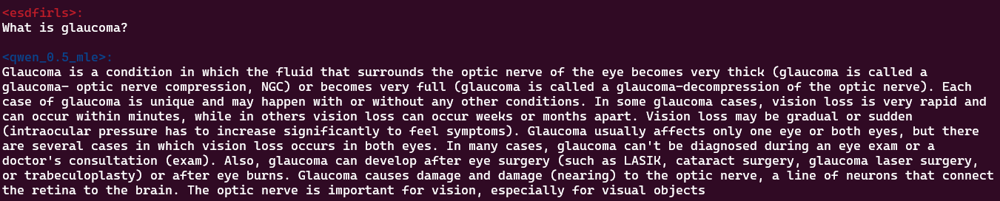

# Supportiv Model Documentation

## Introduction
The Supportiv model is a state-of-the-art text-generation model tailored to provide accurate, contextually relevant, and coherent answers to user medical queries. By leveraging advanced fine-tuning techniques, such as LoRA (Low-Rank Adaptation), the model achieves high performance while maintaining computational efficiency. This documentation provides an overview of the model's development, training, evaluation, and potential areas for improvement, along with example interactions to demonstrate its capabilities.

## Files
The project is organized into the following files:

- **`data_processing.py`**: Contains the `DataProcessor` class for loading, preprocessing, and transforming datasets.
- **`model_training.py`**: Implements the `ModelTrainer` class for fine-tuning the model using LoRA and evaluating its performance.
- **`evaluate_model.py`**: Includes the `Evaluate` class for assessing the model's performance using metrics like F1, ROUGE, and BLEU.
- **`train_accelerate.py`**: The main script to orchestrate data processing, model training, and evaluation.
- **`files/`**: Directory containing dataset files such as `mle_screening_dataset.csv` and PubMedQA JSON files (not used for training, requires more computational power).
- **`adapter/`**: Directory containing adapter-related modules for model fine-tuning.
- **`qwen_0.5_mle/`**: Directory containing Qwen tokenizer, merged model with adapters and configuration files.

## Observations during Development and Training
- Input data is clean and well-structured, with clear distinctions between input and output fields (e.g., "question" and "answer").
- The model is designed for text-generation tasks and assumes that the dataset is suitable for such tasks. The model is adapted to chat template.

## Model Performance
### Strengths
- The model demonstrates strong performance in generating coherent and contextually relevant answers for text-generation tasks.
- It effectively handles long sequences due to its configuration for a maximum sequence length of 512 tokens.
- The use of LoRA (Low-Rank Adaptation) enables efficient fine-tuning with reduced computational overhead. (TRL with Peft used in this challenge)

### Weaknesses
- The model may struggle with highly ambiguous or out-of-domain questions.
- It is sensitive to the quality of the training data; noisy or biased data can negatively impact performance.
- The model's performance may degrade for extremely long or complex queries that exceed its maximum sequence length.

## Potential Improvements or Extensions
- Refining the Model Architecture: Experiment with alternative architectures or larger pre-trained models to improve performance.
- Data Augmentation: Incorporate additional datasets or use data augmentation techniques to improve generalization. (Like pubmedQA, i had a try but it increased a lot the records, 280000+)
- Advanced Fine-Tuning: Explore advanced fine-tuning methods, such as reinforcement learning with human feedback (RLHF).
- Evaluation Metrics: Introduce additional metrics, such as perplexity or human evaluation, for a more comprehensive assessment.
- Error Analysis: Perform detailed error analysis to identify and address specific failure cases.

---

## Data Preprocessing Phase
1. Dataset Loading: The datasets are loaded using the `DataProcessor` class, which supports multiple sources (e.g., MLE screening dataset).
2. Concatenation: Multiple datasets can be concatenated to create a unified dataset for training.
3. Splitting: The dataset is split into training, validation, and test sets using a stratified approach.
4. Transformation: The datasets are tokenized and formatted to match the model's input requirements.

---

## Model Training Phase
1. Configuration: The training process is configured using the `SFTConfig` class, specifying parameters such as `max_length` and `output_dir`.
2. LoRA Integration: The model is fine-tuned using LoRA for efficient parameter updates.
3. Training: The `SFTTrainer` class is used to train the model on the training dataset, with evaluation performed on the test dataset during training.
4. Checkpointing: The model is saved periodically to ensure progress is not lost.

---

## Model Evaluation Phase
1. Evaluation Setup: The evaluation is performed using the `Evaluate` class, which initializes a text-generation pipeline.
2. Metrics: The model is evaluated using F1, ROUGE, and BLEU metrics to assess its performance on the test dataset. 
3. Results: The evaluation results are logged and analyzed to identify strengths and weaknesses.
4. Why they are used: Using these metrics together provides a more comprehensive evaluation of the model's performance:

F1 ensures a balance between precision and recall.
ROUGE emphasizes recall, which is important for capturing the completeness of the generated text.
BLEU emphasizes precision, ensuring that the generated text is accurate and relevant.
By combining these metrics, its better to understand the strengths and weaknesses of model, such as whether it generates text that is accurate, complete, or overly verbose.

---

## Example Interaction
Below is an example of how the model can be used for a QA task:

### Question 1
Input: "What is glaucoma?"  
Output: "What Is Glaucoma?: The glaucoma we've talked about so far are most cases of glaucoma, which occur in the front of the eye (aqueous
humor is the liquid produced by the eye that brings nutrients and drugs to the eyes; when the glaucoma progresses, it damages this
fluid in the eye and the optic nerve. Symptoms of glaucoma may not always be present. These include discomfort or headache (usually
in the head), nausea or vomiting, or blurred vision. In some cases, glaucoma can lead to cataracts, clouding of the lens in the eye.
The severity of glaucoma also depends upon the patient's age and the level of damage to the optic nerve. Usually, glaucoma begins in
your 40s or later and most commonly affects people between 60 and 75. Blood pressure plays an important role in glaucoma. High blood
pressure often precedes damage to the optic nerve and glaucoma. Other risk factors, such as long-term use of alcohol, smoking and a
family history of glaucoma, can increase the risk of developing glaucoma, although it typically does not result in long-term vision
loss. Unfortunately, people cannot control their blood pressure with medications"

### Question 2
Input: "What is (are) Surviving Cancer ?"  
Output: "Surviving Cancer : Survival is very much a word in the eye of the suffering patient and family. Surviving cancer is the belief that
the patient can feel better in the end and live long and healthy lives. Survival means the best of a bad situation. Cancer affects
all races, ethnicities, ages, sex, physical abilities, and religious beliefs. Surviving cancer refers to any kind of cancer that
makes the person feel better and may live longer than people of the same stage of cancer. A more common way to describe survival is
the length of time people are alive after treatment - after treatment. A longer life does not guarantee more time for a cure or a
better quality of life for those who have survived cancer. If people don't get the type of cancer and treatment so that the cancer is
killed, the person living through the disease might live a shorter life than if they'd gotten better treatment. Sadly, most people
who survive cancer do so only to live short lives. However, those who survive many years after the cancer is treated are alive
through both the illness and the treatment itself. Cancer survivors live to age 75-80, although some live much longer. Surviving
cancer is the hope of many people.älle
UIAlertAction
:UIAlert
:UIAlert
UIAlertAction"

### Question 3
Input: "What is (are) Heart Attack ?"  
Output: "Heart Attack : The heart attack we've talked about so far is usually the most common type of heart attack. It occurs when blood flow
to a part of the heart is blocked or reduced by blocked arteries. The heart attack usually occurs at night while you are sleeping,
and it may result in shortness of breath, chest pain, feeling like you are about to faint, or weakness in your legs. When a person
experiences a heart attack they often are rushed to a hospital, where a nurse or doctor will apply pressure to the upper part of the
chest to help get blood flowing to the heart - by opening up the artery in the area. Heart attack is usually fatal, but often heart
attack can be treated. Heart attack is the leading cause of death for men in the United States. meisten heart attacks occur in people
over the age of 65 who smoke a long time or take other medications that suppress or stop the body from converting cholesterol
(cholesterol is a substance that helps to reduce the risk of heart disease; it is also a substance in your blood). Prevention offers
several ways to reduce the risk of a heart attack during your lifetime. When you do start smoking, use cigarettes fewer times, quit
smoking completely, or reduce your tobacco intake, you will lessen the risk of"

